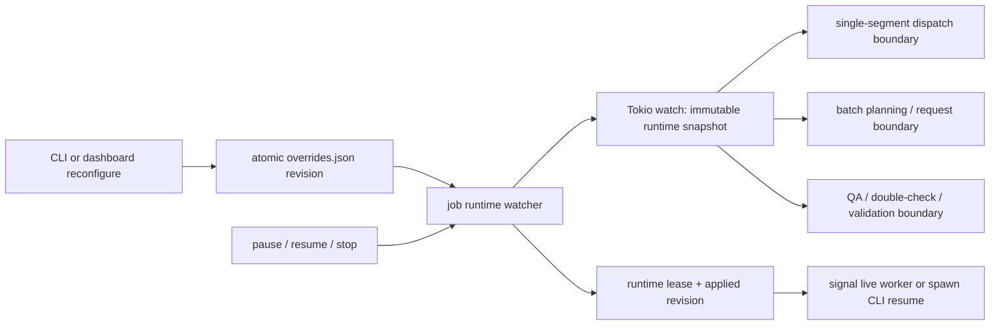

# Live reconfiguration design

Status: implemented and accepted on `codex/project-remediation`
Date: design accepted 2026-07-11; implementation and real-provider acceptance verified 2026-07-13
Source: `docs/codex-handoff-project-remediation-2026-07-10.md` and ROADMAP
§§10.1.3–10.1.4

## Goal

Apply cache-safe scheduling, request-budget, and finalize settings to the
remaining work of an existing job without restarting a live translation
process. A setting change must never mutate an in-flight provider request,
change prompt/cache identity, or retranslate a succeeded segment.

The existing `overrides.json` stop/resume path remains the crash-safe fallback.
Live application is additive: a job with no overrides behaves exactly as it
does today, and an old flat overrides sidecar remains readable.

This design also closes two findings from the manual dashboard exercise:

- retry guidance uses an inline editor instead of `window.prompt()`; and
- Resume signals a live worker, but starts `bookforge resume <job-id>` when the
  original worker has exited.

## Invariants

1. Provider, model, source/target language, profile, segmentation, context,
   prompt version, glossary, style, entities, and cache namespace are immutable.
2. Every provider request uses one immutable runtime snapshot from start through
   all of that request's internal attempts. A newer revision affects only a
   later request.
3. Succeeded/cached/manual segments and manual-correction freezes are untouched.
4. Revisions are monotonic. Readers retain the last valid snapshot if a newer
   sidecar is partial, invalid, or unsupported.
5. The sidecar is the durable source of pending/effective overrides. It remains
   after stop/crash and is cleared only after successful terminal finalization.
6. Existing event variants and JSON fields remain compatible; all event/state
   additions are additive.
7. No new dependency or database migration is required.

## Architecture



### Durable sidecar

Replace direct `fs::write` with staged-sibling write, flush, and atomic rename.
The new envelope is:

```json
{
  "schema_version": 1,
  "revision": 3,
  "updated_at_ms": 1783790000000,
  "overrides": {
    "batch_max_output_tokens": 12000,
    "batch_max_items": 3,
    "concurrency": 2
  }
}
```

The loader accepts both this envelope and the current flat
`RunConfigOverrides` object. A flat object is revision 0 and is rewritten as an
envelope on the next edit. Writers serialize across CLI/dashboard processes
with an adjacent `overrides.lock` acquired through `create_new`; a bounded stale
lock lease recovers from a crashed writer. While holding it, the writer reloads
the current revision, merges the typed partial update, validates it, increments
the revision, and atomically replaces the sidecar. The watcher detects
content-hash changes rather than depending on filesystem timestamp granularity.

Validation rejects zero numeric limits and immutable fields instead of silently
clamping them. The same parser/validator is used by CLI, dashboard, live watcher,
and resume.

### Runtime snapshots and channels

Add a CLI-owned `JobRuntimeSettings` containing:

- revision and the complete effective `ResolvedRunSettings`;
- QA mode and `validate_output`, which live outside that structure.

The durable override document remains the source for validated changed-field
names used by events and the dashboard.

Derive an engine-facing `EngineRuntimeSettings` containing only batch config,
target concurrency, provider attempt limit, and adaptive toggles. Add an
optional `tokio::sync::watch::Receiver<EngineRuntimeSettings>` to
`TranslationRunConfig`. `None` preserves current behavior for library callers
and existing tests.

Extend the existing `ControlFileWatcher` into the long-lived job runtime
watcher. It keeps one store/poller instance, watches both control and override
sidecars, publishes only validated immutable snapshots, and emits a rejection
once per invalid content hash. At each control boundary it reloads overrides
before applying a Resume command, so a sequential reconfigure-then-resume
cannot dispatch under the previous revision.

### Boundary semantics

| Setting | First legal application point | Required behavior |
| --- | --- | --- |
| `concurrency` | next dispatch/acquire | Existing requests finish; later dispatch observes the new target. Use the existing burn-permit limiter mechanism so shrinking never blocks the control loop. |
| `batch_max_output_tokens` | next provider request | Snapshot once before request attempts. An already-running request keeps its old budget. Truncation escalation for later attempts uses the newest baseline. |
| `batch_max_items`, `batch_target_tokens` | next unstarted batch | Repartition only unstarted items within the same section/mode. Never merge or split an in-flight batch. |
| `adaptive_batch_sizing` | next unstarted batch | Enabling creates sizing state from the new baseline; disabling stops adaptation without rewriting in-flight work. |
| `adaptive_concurrency` | next request completion/acquire | Preserve current limiter target, then enable/disable automatic feedback; explicit concurrency remains the upper target. |
| `provider_max_attempts` | next provider call | The provider snapshots the limit before its attempt loop; do not change a call already retrying. |
| `qa` | QA stage entry | Snapshot once for the stage. A change after QA starts applies on a later resume, not halfway through reviews. |
| `double_check` | double-check stage entry | Snapshot once for the whole stage. |
| `validate_output` | validation stage entry | Snapshot once immediately before deciding whether to validate. |

The single-segment scheduler replaces its fixed `concurrency` local with the
latest snapshot at every dispatch loop. The batch scheduler replaces its fixed
semaphore with an adjustable limiter and reads a snapshot before normalizing and
spawning each batch.

Batch retry/escalation bookkeeping must no longer rely solely on mutable batch
IDs. Key it by stable ordered item IDs (a `BatchWorkKey`) so repartitioning and
existing adaptive renaming cannot lose attempt counts or escalated budgets.
When a revision changes, rebuild only the pending queue from its remaining item
set; completed and in-flight item IDs are excluded.

### Provider attempts

`OpenAiCompatibleProvider` currently owns a fixed `provider_max_attempts`.
Give it an optional runtime receiver (or an `Arc<AtomicUsize>` fed by the same
publisher) and snapshot the value at the beginning of `complete`. Mock and
other providers retain their current fixed behavior unless they implement an
internal retry loop. The request event records the effective revision and
attempt limit for auditability.

### Runtime lease and dashboard Resume

The translation process writes
`.bookforge/runs/<job-id>/runtime.json` atomically with:

- a random run-instance ID, PID, and process start time;
- last heartbeat time;
- last loaded and last applied override revision.

The runtime watcher refreshes it at most once per second and removes it on clean
exit. A lease older than three heartbeat intervals is stale; the random
instance ID prevents a stale PID from being treated as the current worker.

`POST /api/jobs/{id}/resume` then behaves as follows:

- fresh lease: write the Resume control command and return `mode: "signaled"`;
- stale/missing lease plus resumable translation or finalize work: spawn the
  current executable as `bookforge resume <id> --ui quiet`, adding `--force`
  for a dead paused worker, return `mode: "spawned"`, and surface startup
  failure;
- no resumable work: return an actionable 400 instead of pretending the job is
  running.

Pause and Stop require a fresh lease; otherwise they return a message explaining
that no worker is alive. All endpoints remain loopback-only and CSRF protected.

### Dashboard surface

Add `GET` and `POST /api/jobs/{id}/reconfigure`. The GET response contains the
effective values, durable overrides, revision, applied revision, and lease
state. The POST accepts only the typed mutable fields and returns the new
revision plus `live`, `next_boundary`, or `resume_required` application state.

The Progress screen gets an inline “Runtime settings” panel. It is editable for
running, paused, or stopped jobs with resumable work; immutable identity is
display-only. Save feedback names the revision and boundary. Runtime events
update the panel without a full refresh.

On Review, “Re-translate with hint” expands an inline textarea with Cancel and
Queue retry buttons. Because retrying running/paused jobs remains rejected, the
panel explicitly says “Stop the job before queuing a retry” and offers Stop.
After queuing, Resume uses the lease-aware behavior above.

## Events and replay state

Add:

- `RuntimeConfigChanged { revision, changed_fields, application, timestamp_ms }`;
- `RuntimeConfigRejected { revision, message, timestamp_ms }`.

`application` is `next_request`, `next_batch`, `next_stage`, or
`resume_required`; multiple affected boundaries may be represented as a list.
Extend `RequestStarted` with optional `runtime_config_revision` and
`provider_max_attempts` fields. Extend `RunState` with the latest valid revision,
changed field list, and last rejection. Old event logs deserialize through
defaults, and all renderers show a compact change/rejection line.

The existing `RuntimeConfigResolved` remains the initial full snapshot event.

## Race and regression tests

### Unit tests

- legacy flat sidecar loads; envelope revision increments; atomic writer leaves
  no partial target;
- immutable/zero/unknown settings reject and leave the last valid snapshot;
- watcher publishes once per revision and once per invalid content hash;
- adjustable limiter grows and shrinks without cancelling held permits;
- provider attempt count is fixed for one call and changes on the next;
- pending batch repartition preserves item IDs, retry counters, truncation
  escalation, section/mode boundaries, and adaptive batch renaming.

### Scheduler tests

- reconfigure while requests are in flight: old requests report revision N and
  later requests report N+1;
- pause → reconfigure → resume dispatches no post-resume request under N;
- concurrency shrink waits for natural completion and bounds later activity;
- stop wins over a simultaneous reconfiguration and dispatches nothing new;
- channel closure retains the last snapshot and does not fail the run.

### Lifecycle tests

- single and batch mock jobs apply live budgets/concurrency without
  retranslating succeeded segments;
- batch target/item changes survive adaptive renaming and crash/resume;
- QA/double-check/validation changes apply only at their stage boundary;
- valid overrides survive crash and are consumed after successful resume;
- successful completion clears the sidecar and lease; stop/crash preserves
  overrides and leaves a stale/recoverable lease;
- dashboard reconfigure, hint, control, and spawn-resume routes enforce Host and
  CSRF protections and use an isolated store;
- a missing/stale worker makes dashboard Resume spawn one process exactly once
  (concurrent clicks are deduplicated by an atomic launch claim).

### Automated implementation evidence (2026-07-13)

- The engine suite passes 154 tests, including request snapshotting, live
  single/batch concurrency and budget changes, pause/reconfigure/resume
  ordering, stop precedence, channel closure, pending repartition, adaptive
  naming, escalation, and limiter growth/shrink.
- The CLI suite passes 160 unit, 45 lifecycle, and 16 round-trip tests. The
  lifecycle coverage exercises live single/batch runs, finalize-stage
  snapshots, stop/resume sidecar persistence, successful cleanup, and stale
  crash leases. Dashboard route tests use an isolated store and cover typed
  revisioned edits, CSRF/Host protection, lease-aware controls, finalize-only
  work, dead-paused forced relaunch, launch deduplication, and completed-job
  rejection.
- `cargo fmt --all --check`, the exact all-target/all-feature CI clippy command
  with warnings denied, and the Rust 1.88 workspace all-target check pass on
  Windows. After replacing the documented fixed-sleep stop/resume flake with
  an event-driven boundary, the clean linked workspace run passes in full:
  160 CLI unit, 45 lifecycle, 16 round-trip, 59 core, 154 LLM, 31 PDF, and 35
  store tests, plus EPUB and documentation tests.
- The embedded dashboard JavaScript passes a Node syntax check. The earlier
  manual correction/dashboard exercise and the real-provider acceptance below
  are green.

### Manual acceptance (completed 2026-07-13)

The packaged Windows v2.4.0 binary translated an isolated 13-segment synthetic
EPUB through `deepseek-v4-flash` with one initial worker and one-item batches.
The run was paused after its first request started, then revision 1 changed
concurrency, batch sizing, adaptive behavior, and provider attempts before
Resume. Persisted events prove the in-flight request retained revision 0,
concurrency 1, and two provider attempts; the next 12 requests used revision 1,
concurrency 2, and three provider attempts. All requests completed without
429s, timeouts, server errors, invalid output, or truncation.

After completion, a human correction on one segment rebuilt the EPUB and
report while remaining frozen as provider `manual`. A guided dashboard retry
on a different segment persisted across processes; dashboard Resume launched a
replacement worker, increased only that segment's attempt count from 1 to 2,
marked the guidance consumed, and left the correction intact. The final job was
`succeeded`, runtime sidecars were gone, and BookForge structural validation
passed. The credential and generated acceptance state remained outside the
tracked worktree under `tmp/`.

## Implementation order

1. Sidecar envelope, atomic persistence, shared validation, snapshots, events,
   and replay state.
2. Runtime watcher/channel and process lease, preserving the old `None` channel
   behavior.
3. Single-segment dynamic dispatch and provider attempt snapshots.
4. Batch adjustable limiter, pending-item repartition, and stable work keys.
5. Finalize-stage snapshots and terminal cleanup.
6. Dashboard reconfigure API/panel, lease-aware controls, and inline hint UI.
7. Full tests, exact clippy, MSRV 1.88, small/full corpus as appropriate, and a
   real-provider manual acceptance run before release.

## Non-goals

- Changing cache/prompt identity or segmentation in an existing job.
- Cancelling or rewriting an in-flight provider request.
- Multi-user/remote dashboard operation or a general job queue.
- Reconfiguring a successfully completed job.
- Moving configuration state into SQLite in this milestone.
